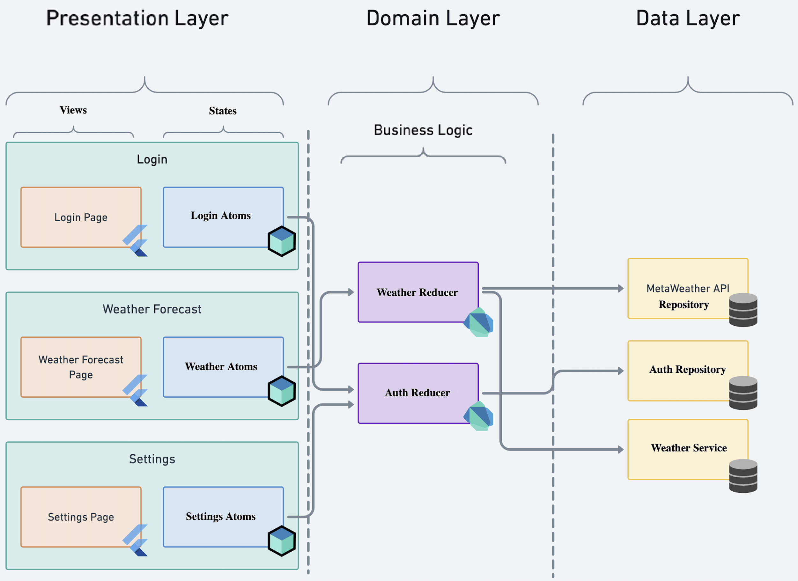

# My Location Project (Mobile)

## Challenge

Build an app for one platform (Android or iOS) to load the current location of the user in the map with and without the device's location feature.

The app needs to use the device's GPS feature and load the location with a pin displayed in the map. However, if the GPS is unavailable, the app must request the IP API in order to retrieve the approximate location and load the pin at this location of the map.

#### Requirements

The app must contemplate the following requirements:

Must use the GPS to retrieve the current location (will be tested with the GPS turned on and off)
Must display a pin in a Map View to indicate the current location
Must work offline (will be tested with airplane mode)
Must support multiple resolutions and sizes

#### Location retrieval

You must use the IP API.

API documentation:

- https://ip-api.com/docs/api:json

## Installation

Follow the Flutter's website installation steps:
- https://docs.flutter.dev/get-started/install

## Project execution
To run this project via command line make sure you are in the Mobile application root folder:
1. Create and add a '.env' file in the project root, fill in the variable values for the desired environment:
```
API_URL=base_url_of_api
MAP_KEY=api_key_of_google_maps
```

In this case the API_URL should be 'http://ip-api.com'
and for more information about create a Google Maps API Key, visit:
- https://pub.dev/packages/google_maps_flutter#getting-started

2. Run the `flutter pub get` command to download the dependencies and create the internationalization files.
3. Run the command `flutter run --dart-define-from-file=.env` to run the application or use 'Start Debugging (F5)' from the 'Run and Debug' tab of Visual Studio Code if you are using it.

## Architecture
It follows the Very Good Ventures architectural approach, adapted for use with the Atomic State pattern.

There are 3 layers: Data, Domain and Presentation.

Data:
Layer that contains access to data, here are the implementations of services, repositories and / or data sources.

Domain:
Layer that contains the models and business rules relating to the functionalities of the feature, here are the models and reducers.

Presentation:
Layer that contains the pages, components (widgets) and atoms, here are the frameworks referring to the user interface and the states of the views.



To find out more see:
- [Very Good Architecture](https://verygood.ventures/blog/very-good-flutter-architecture).
- [Atomic State Pattern by Flutterando](https://blog.flutterando.com.br/introdução-ao-estado-atômico-no-flutter-com-rxnotifier-73ad9edf8718).

### Project structure
The organization of directories and files follows this:

In features folder we have the specific settings for each functionality and in core folder we have the settings and components shared with the rest of the application.

In the test folder, at the root of the project, I create a mirror of the lib structure to facilitate code maintenance, that is, follow the same folder structure path to create a test file, if you are using Visual Studio Code, just right-click on above the desired file and access the 'Go to Tests' menu and then create the test file.

The folders structure is denoted below:
```
lib/
 |- core/
   |- adapters/
   |- atomic_state/
   |- config/
   |- exceptions/
   |- extensions/
   |- injector/
   |- models/
   |- services/
   |- utils/
 |- features/
   |- location/
     |- atomic_state/
     |- controller/
     |- injector/
     |- models/
     |- repository/
     |- view/
       |- pages/
       |- widgets/
 |- main.dart
 |- app.dart

test/
 |- core/
 |- features/
 
```

### Testing and coverage

To run the tests and check the project's code coverage, in your terminal, at the root of the project, run the command `flutter test --coverage`. This command will generate a folder in the root called "coverage", containing a file called "lcov.info".

This file can be used by a code analyzer (SonarQube, CodeCov, etc.) to define the percentage code coverage. VSCode plugins can also be used for this, such as 'Coverage Gutters' and 'Flutter Coverage'.

## Plugins and packages used
- [dio](https://pub.dev/packages/dio)
- [dson_adapter](https://pub.dev/packages/dson_adapter)
- [equatable](https://pub.dev/packages/equatable)
- [flutter_localizations](https://docs.flutter.dev/ui/accessibility-and-localization/internationalization)
- [geolocator](https://pub.dev/packages/geolocator)
- [get_it](https://pub.dev/packages/get_it)
- [google_maps_flutter](https://pub.dev/packages/google_maps_flutter)
- [intl](https://pub.dev/packages/intl)
- [http_mock_adapter](https://pub.dev/packages/http_mock_adapter)
- [mocktail](https://pub.dev/packages/mocktail)
- [very_good_analysis](https://pub.dev/packages/very_good_analysis)

## Architectural Decision - ADR

About ADR - Architecture Decision Record:
https://adr.github.io/

## **Architecture:**

### **Very Good Architecture**

**Why I chose:**
More adaptable and pragmatic, maintaining clean architecture approaches with low coupling between layers, facilities for modularizing, scaling and developing tests.

**Other options:**
Use patterns such as MVC, MVP or MVVM with the Repository Pattern.


### **Atomic State Pattern**

**Why I chose:**
Ease of learning (Noob Friendly), solves communication problems between states and follows the SOLID principles.

**Other options:**
Riverpod, BLoC, MobX, etc..

___________________________________________________________________________
## **Plugins / Packages:**

### **dio**

**Why I chose:**
Maintained by a large group and community in China, it is a powerful http client with many features.

**Other options:**
http, uno

___________________________________________________________________________
### **dson_adapter**

**Why I chose:**
It facilitates the conversion of JSON Map to Dart classes, as well as managing exceptions linked to the conversion, for example due to the lack of an attribute or a change in its type.

**Other options:**
dson (requires code generator)

___________________________________________________________________________
### **equatable**

**Why I chose:**
Maintained by the community, it facilitates development, so the boilerplate is made using other options.

**Other options:**
Overriding the equality operator and HashCode

___________________________________________________________________________
### **flutter_localizations**

**Why I chose:**
Used by the Flutter SDK itself.

**Other options:**
flutter_localization

___________________________________________________________________________
### **geolocator**

**Why I chose:**
The two options we have are widely used, I chose this one because it seems to be more popular.

**Other options:**
location

___________________________________________________________________________
### **get_it**

**Why I chose:**
Due to its ease and wide use in the community.

**Other options:**
auto_injector, provider, riverpod

___________________________________________________________________________
### **google_maps_flutter**

**Why I chose:**
Made by the Flutter team itself.

**Other options:**
I don't see any good alternatives, maybe create a plugin or use webview

___________________________________________________________________________
### **intl**

**Why I chose:**
Made by the Dart team itself and used by the entire community.

**Other options:**
intl_utils

___________________________________________________________________________
### **dart-define-from-file command**

**Why I chose:**
By assigning the project's sensitive variables and keys in a single file, there is no need to store them in the git repository, they will be encrypted together with the project code.

**Other options:**
dotenv e envied

___________________________________________________________________________
### **http_mock_adapter**

**Why I chose:**
Makes it easier to build dio package mocks.

**Other options:**
mockito, mocktail

___________________________________________________________________________
### **mocktail**

**Why I chose:**
Due to ease of use and it is not necessary to use a code generator.

**Other options:**
mockito

___________________________________________________________________________
### **very_good_analysis**

**Why I chose:**
Great linter maintained by a large company specializing in flutter and dart.

**Other options:**
flutter_lint, lints

## Patterns and Techniques

**Atomic State Pattern:**
I chose the atomic states pattern for application state management because is ease to use and learning, but any type of management can be used, such as BLoC, Mobx or Riverpod. More information:
[ASP - Atomic State Pattern](https://github.com/Flutterando/asp)

I used _Dependency Inversion_, one of the _SOLID_ principles.

**Dependency Inversion Principle — DIP:**
It is the strategy of relying on interfaces or abstract classes, rather than concrete classes.

This way, dependency injection is done via the class constructor parameter and/or provider references.

**Repository Pattern:**
I do use of the Repository, but I do not see the need to create interfaces and abstractions for repositories and services, since these classes should not have extensions or other heirs, the language dart provides us with facilities for testing via implicit interfaces.

**Mock Object:**
I used Mock Object to build unit and widget tests.

**Test Driven Development — TDD:**
The TDD technique can be used to develop unit tests and widgets for any and all functionality implemented in the application.

Inversion of Control:
https://en.wikipedia.org/wiki/Inversion_of_control

DIP:
https://en.wikipedia.org/wiki/Dependency_inversion_principle

Implicit Interfaces:
https://dart.dev/language/classes#implicit-interfaces

Mock Object:
https://en.wikipedia.org/wiki/Mock_object

TDD:
https://www.browserstack.com/guide/what-is-test-driven-development

## Application Deployment

To deploy automatically, you can use CI and CD services, examples in the cloud: Azure DevOps, GitHub Actions or CodeMagic or locally with Fast Lane.

For a simpler project, I recommend using the CodeMagic service, due to its ease and speed in configuration, on the other hand, if it is a more complex business project, I recommend building the pipelines directly with the most popular services such as Azure DevOps or GitHub Actions by its number of features and integrations.

You will need to sign the project for publication.

To deploy manually, follow the steps on the flutter website:
- [Android Deploy](https://docs.flutter.dev/deployment/android)
- [iOS Deploy](https://docs.flutter.dev/deployment/ios)

To create a release via the flutter command, in the project root, run:

- Build AppBundle For Android:
`flutter build appbundle --dart-define-from-file=.env --release --obfuscate --split-debug-info=./build/debug-info`

- Build IPA for iOS:
`flutter build ipa --dart-define-from-file=.env --release --obfuscate --split-debug-info=./build/debug-info --export-options-plist ios/Runner/export.plist`

To build via continuous delivery, follow the instructions on the flutter website:
[Continuos Delivery](https://docs.flutter.dev/deployment/cd)
